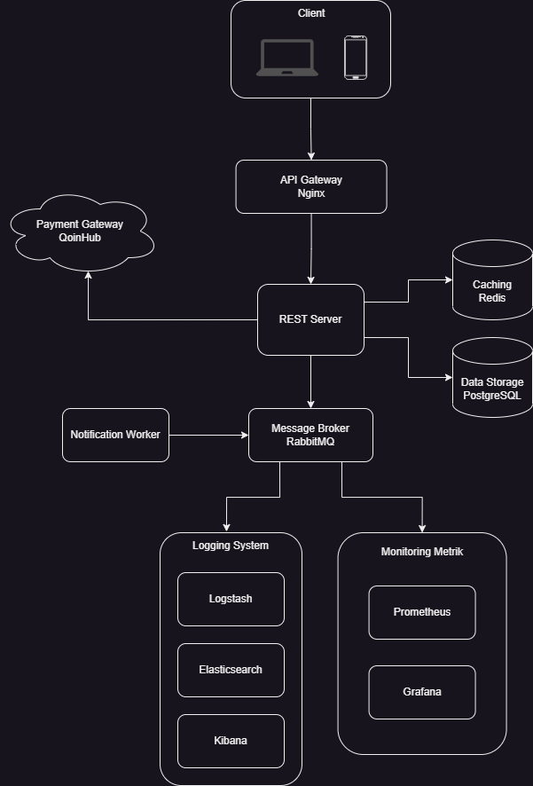

# Rumah Makan - PT Qoin Digital Indonesia
Sistem ini dirancang sebagai bagian dari proses rekruitment di PT Qoin Digital Indonesia tahap technical test.

## Background
Rancangan sistem ini dimaksudkan untuk mengoptimalkan proses bisnis yang ada di rumah makan. 
 
Kebutuhan utama dari sistem yang harus dipenuhi :
1. Aplikasi ini bisa memasukkan pesanan-pesanan makanan pelanggan
2. Aplikasi ini bisa mengeluarkan struk pembelian
3. Aplikasi ini bisa mengeluarkan laporan penghasilan mingguan dan bulanan
4. Aplikasi ini bisa mengeluarkan laporan stok

Batasan :
1. Hanya waiters yang dapat memasukkan pesanan pelanggan dan mengajukan struk pembelian kepada kasir jika pelanggan telah selesai
2. Pesanan akan di kirim ke kitchen atau barista tergantung menu yang dipesan
3. Struk pembelian akan dikeluarkan oleh kasir setelah mendapat pengajuan dari waiters, kemudian setelah pembayaran diterima kasir akan mengklik tombol konfirmasi
4. Laporan penghasilan dan stok hanya bisa di cetak oleh admin

Entitas :
1. Admin :
- Menambahkan dan menghapus data karyawan serta memberikan role
- Menambah, merubah, atau menghapus data menu
- Mengeluarkan laporan penghasilan dan melihat history transaksi
- Mengeluarkan laporan stok

2. Kasir
- Menerima pembayaran
- Mencetak struk pembelian

3. Waiters
- Meng-input pesanan pelanggan
- Konfirmasi jika pesanan sudah di antar

4. Kitchen
- Membuat pesanan
- Konfirmasi pesanan setelah selesai dibuat

5. Barista
- Membuat pesanan
- Konfirmasi pesanan setelah selesai dibuat

## Desain Arsitektur
1. Arsitektur Sistem
Dalam perancangan sistem Rumah Makan ini, penulis menerapkan arsitektur monolitik. Arsitektur monolitik cocok untuk aplikasi dengan skala kecil hingga menengah, sehingga lebih mudah untuk memulai dan mengembangkan aplikasi dengan tim yang relatif lebih kecil.

2. Tech Stack
- Nginx : Penulis menggunakan Nginx sebagai API Gateway sebagai entry point untuk masuk ke server backend. Nginx juga memiliki fitur Load Balancer, fitur ini bisa dimanfaatkan jika suatu saat dibuthkan horizontal scalling.

- Golang : Penulis menggunakan golang untuk bahasa pemrograman utama, dimana golang terbukti cepat dan ringan serta memiliki manajemen memory yang efisien dengan fitur garbage collection, ditambah fitur concurency yang dapat diterapkan dengan mudah menggunakan goroutine dan channel membuat aplikasi dapat mengerjakan banyak task secara concurent.

- Gin Framework : Gin adalah framework web yang ringan dan cepat, cocok untuk aplikasi yang memerlukan kinerja tinggi. Penerapan gin juga relatif mudah dan memiliki dokumentasi yang lengkap, membuat proses development lebih cepat.

- Prometheus dan Grafana : Digunakan untuk mengumpulkan metrik dari sistem dan aplikasi, melakukan monitoring dan alerting serta menampilkan data metrik dalam bentuk grafis yang mudah dipahami.

- ELK (Elasticsearch, Logstash, Kibana) : Digunakan untuk mengumpulkan, mengindeks, dan menganalisis log yang memungkinkan pencarian cepat dan analisis mendalam terhadap data log. Stack ini juga berguna untuk membantu dalam menemukan dan mendiagnosis masalah dengan mengurai data log.

- PostgreSQL : Digunakan sebagai Data Storage. PostgreSQL adalah salah satu RDBMS yang open-source, dikenal dengan performa yang kuat dalam mengelola volume data besar dan jumlah transaksi tinggi, dan menawarkan dukungan database transaction dengan menerapkan ACID (Atomicity, Consistency, Isolation, Durability). Selain itu PostgreSQL juga memiliki komunitas yang besar dan aktif.

- Redis : Digunakan sebagai cache untuk meningkatkan kinerja aplikasi dengan menyimpan data yang sering diakses dalam memori sehingga mengurangi waktu akses dan beban pada database.

- RabbitMQ : Digunakan sebagai message broker, dimana dengan menerapkan teknologi ini dapat mengurangi beban server dan menangani pengiriman pesan secara asinkron antara berbagai komponen dalam aplikasi.

- Qoin Hub : Digunakan sebagai payment gateway untuk menerima berbagai macam metode pembayaran secara digital.

## Desain Database

## API Specification